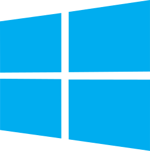

<head>
	<meta charset="utf-8">
	<meta name="viewport" content="width=device-width, initial-scale=1">
	<link rel="icon" type="image/icon" href="rcs/favicon.png">
	<link rel="stylesheet" type="text/css" href="css/style.css">
	
	<a class="top-link hide" href="#top">↑</a>
</head>

## S̶̜̭̈͘͝Ỗ̸͍̺F̸͙͔͆̓T̵̠̼͎͐̈́͂W̴͍͉̙͒Ã̴͇͔̇̋Ṛ̷̱͚̋́E̸̓

## Table of Content

###   

| Name | Description |
| :---: | --- |
| [Blender](https://www.blender.org) | Modeling, Animation (2D & 3D), Simulation |
| [Krita](https://krita.org/en) | |
| [OBS Studio](https://obsproject.com) | |
| [GIMP](https://www.gimp.org) | |
| [Inkscape](https://inkscape.org) | |
| [FreeCAD](https://www.freecad.org) | |
| [Pencil2D](https://www.pencil2d.org)| 2D hand-drawn animations |
| [UPBGE](https://upbge.org/) | Fork of Old Blender Game Engine |
| [Thunderbird](https://www.thunderbird.net/en-US/) | Email Client |

### Apps 

| Name | Description |
| :---: | --- |
| [FotoSketcher](https://fotosketcher.com) | Turn photos into art |

